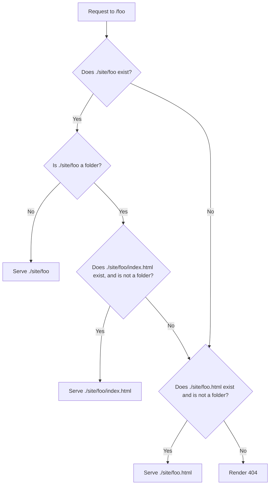

# Auth Server

## What is this?

This is a utility/example http hosting server, that has authentication for some pages.

There is 1 very specific use case for this:

1. You have html files, with no need for SSR
2. You want to do either/or:
   - basic authentication using the default browser login alert
   - redirects
   - headers
3. You have a lot of pages that require different usernames/passwords
5. There is no "individual user" - users have to log in using this specific password

The only actual use case for this that I can think of (and why I even made this in the first place) is for browser based puzzle games like notpron.

## How to use

1. Place your site contents into a folder called `site`
2. Create a file called `config.yaml`, and enter passwords (see syntax below)
3. Run `go install github.com/shadiestgoat/authServer@latest`
4. Run `authServer` in the directory with the `config.yaml` and `site` folder
   - You can set the `PORT` env variable to change the port this server runs on, by default its 3000
   - Note - there isn't any sort implementation for htaccess (unless browsers implement it) or anything like that, its just a static file host w/ authentication for some files
   - There is `index.html` resolution. See file resolution sub-heading.

## Configuration

The `config.yaml` file is the primary way of configuration.

```yaml
/path/to/page:
   # if present, will require the user to input a username/password
   auth:
      username: string
      # optional
      password: string
      # optional, defaults to the path to this page
      realm: string
   # any headers here will be sent over to the user. Values can be an array, or a string. If values are an array, then multiple headers with the same name will be sent.
   headers:
      Example-Header-Name: Value
      Multi-Value-Header:
         - Value 1
         - Value 2
   # Optional. If present, will redirect to this page.
   redirect: /abc/321
   # Optional. If present, will render the page in /abc/123, with these settings.
   fakeRender: /abc/123
/path/to/other/page:
   # same syntax here
   auth:
      username: string
```

## URL Rules

Wildcards are supported. Use `*` as a wildcard to match 1 path section (ie. area between 2 `/`). Use `**` to match unlimited path sections. 
The shortest match route will be used. 
If there is are 2 matches with later wildcard at different levels, then the one with the later one wins. 

See match table below

| .       | /foo  | /bar  | /foo/bar |
| :------ | :---: | :---: | :------: |
| /foo    |   ✅   |  :x:  |   :x:    |
| /*      |   ✅   |   ✅   |   :x:    |
| /**     |   ✅   |   ✅   |    ✅     |
| /**/bar |  :x:  |  :x:  |    ✅     |

Given 2 routes are defined:

```
/foo/bar/*
/foo/*/bar
```

Then when matching `/foo/bar/bar`, `/foo/bar/*` wins.

## File Resolution

There is special file-path resolution. For example, lets say `/foo` is requested.



## ENV Variables

As mentioned before, you can add env variables. This is supported through both the `.env` file and just regular ENV (`ENV_VAR=ENV_VAL authServer`). As mentioned before, one such variable is `PORT`, which decides which port your app runs on (default: 3000).

The other 2 are a bit different - `MSG_404` and `MSG_401`. These are 2 of the response messages that server responds with. 404 is for missing pages, 401 is for responses with the incorrect username/password. Special quirk with these is that if you set them to be `<file>`, then you can write them in a file - `404.html` and `401.html` **in the root directory**.

> [!NOTE]\
> Root directory is the directory that contains your `.passwords` file and the `site` folder.

## Limitations/Quality

> [!IMPORTANT]\
> I created this in a rush. I do not plan on supporting this project (unless there are major bug fixes that are needed).

